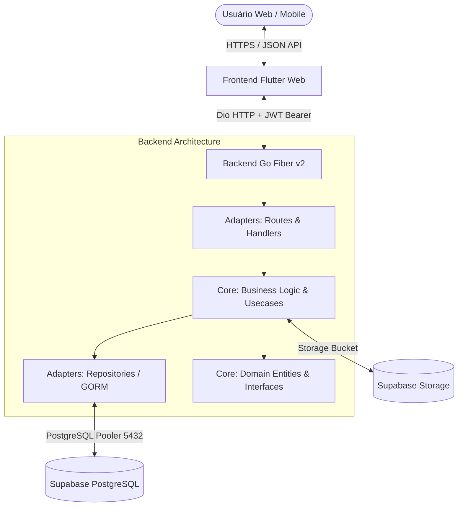

# 🦷 Dental Clinic CRM — Premium Software Portfolio

[](https://go.dev/)
[](https://flutter.dev/)
[](https://riverpod.dev/)
[](https://supabase.com/)
[](https://render.com/)
[](https://vercel.com/)
[](.github/workflows/ci.yml)

> **Sistema de Gestão Clínica Odontológica Multi-Tenant Full-Stack (Go + Flutter).**  
> Desenvolvido com foco em **Clean Architecture**, **Alta Performance**, **Isolamento Estrito de Dados (Multi-Tenancy)** e **Design System Clinical Precision Glass**.

---

## 🌐 Live Demo & Acesso Público

Este repositório está configurado para **exibição pública de portfólio**. Você pode acessar a aplicação em produção utilizando as credenciais públicas de demonstração abaixo:

- 🔗 **Frontend Web (Vercel):** [https://crm-dental-mu.vercel.app](https://crm-dental-mu.vercel.app)
- ⚙️ **Backend API (Render):** [https://crm-dental-lap6.onrender.com](https://crm-dental-lap6.onrender.com)

### 🔑 Credenciais da Clínica Demo:
| Perfil | E-mail | Senha |
| :--- | :--- | :--- |
| **Dono da Clínica (Owner)** | `admin@clinica.com` | `123456` |

> 🔒 **Nota de Segurança:** Nenhuma chave de API privada, token de produção ou segredo real é versionado neste repositório. O banco de dados demo utiliza *seeding* automático isolado.

---

## 🚀 Módulos & Recursos Principais

### 🦷 1. Prontuário Eletrônico (EMR) & Odontograma Interativo
- Histórico clínico completo com suporte a nota em formato **Quill Delta**.
- Odontograma visual interativo por dente e superfície (hígido, restaurado, canal, extração).
- Galeria de exames e arquivos de imagem com visualizador lightbox integrado.

### 📅 2. Agendamento Multi-Salas & Fila de Espera
- Grade horária flexível com alocação por dentista, sala cirúrgica e procedimento.
- Fila de espera dinâmica com cálculo aproximado de horário de atendimento.

### 📊 3. Gestão Financeira & Orçamentos
- Emissão e controle de orçamentos odontológicos detalhados com itens de procedimento.
- Lançamento de receitas, despesas, parcelamentos e geração automática de recibos em PDF.

### 📦 4. Controle de Estoque & Consumo
- Cadastro de materiais com alerta automático de estoque mínimo.
- Baixa automática de insumos atrelada aos procedimentos efetuados.

### 💳 5. SaaS Billing & RBAC (Multi-Tenancy)
- Suporte a múltiplos consultórios com isolamento rigoroso por `clinic_id`.
- Controle de acesso baseado em cargos (*Owner, Manager, Doctor, Receptionist*).

---

## 📐 Arquitetura da Solução

O projeto segue os princípios de **Clean Architecture** e **Separation of Concerns**:



---

## 🛠️ Stack Tecnológica

### Backend (`backend-go/`)
- **Linguagem:** Go 1.26
- **Framework HTTP:** Fiber v2 (Fast HTTP framework)
- **ORM & DB Driver:** GORM + Supabase PostgreSQL Driver
- **Autenticação:** JWT (`golang-jwt/v5`) com hash `bcrypt`
- **Segurança:** Middleware RBAC, Criptografia AES, Middleware Multi-Tenancy

### Frontend (`frontend_flutter/`)
- **Framework:** Flutter 3 (Web & Mobile Target)
- **Gerenciamento de Estado:** Riverpod (Notifier & Provider Pattern)
- **Roteamento:** GoRouter
- **Cliente HTTP:** Dio (com interceptores de autorização e reconexão 401)
- **UI/UX:** Material 3, Lucide Icons, Google Fonts, PDF Generator

---

## 💻 Instruções para Execução Local

### Pré-requisitos
- [Go 1.26+](https://go.dev/dl/)
- [Flutter SDK 3.x+](https://docs.flutter.dev/get-started/install)
- [PostgreSQL](https://www.postgresql.org/) ou conta [Supabase](https://supabase.com/)

### 1. Clonar o Repositório
```bash
git clone https://github.com/DanieCoimbra/CRM-Dental.git
cd CRM-Dental
```

### 2. Configurar e Rodar o Backend (Go)
```bash
cd backend-go
cp .env.example .env # ajuste a DATABASE_URL e JWT_SECRET se necessário
go run cmd/server/main.go
```
*A API iniciará por padrão em `http://localhost:8080`.*

### 3. Rodar os Testes do Backend
```bash
go test -v ./...
```

### 4. Configurar e Rodar o Frontend (Flutter)
```bash
cd ../frontend_flutter
flutter pub get
flutter run -d chrome
```

### 5. Rodar os Testes do Frontend
```bash
flutter test
```

---

## 📄 Licença & Propriedade Intelectual

Este repositório foi desenvolvido para fins de **demonstração de portfólio profissional**.  
Código distribuído sob a licença **MIT**. Sinta-se livre para examinar, clonar e utilizar como referência técnica.
