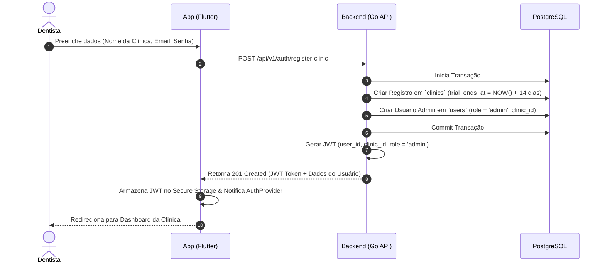

# Workflow da Fase 0 — Fundação (SaaS Clínica Dental Solo)

Documento de especificação, planejamento e arquitetura para a **Fase 0 — Fundação** do sistema de gestão para clínicas odontológicas (dentista solo).

---

## 1. Visão Geral da Fase 0

A **Fase 0** estabelece a base arquitetural e de segurança do SaaS de gestão para clínicas de 1 consultório (dentista solo). Seu objetivo é garantir isolamento de dados, autenticação robusta, skeleton limpo no frontend/backend e papéis de usuário simplificados.

### Objetivos Principais:
1. **Multi-tenancy Simplificado:** Isolamento lógico via `clinic_id` em todas as tabelas e requisições.
2. **2 Papéis Fixos (RBAC Estático):**
   - **Dentista / Admin:** Acesso total (clínico, financeiro, agenda, configurações).
   - **Recepcionista:** Acesso restrito (agendamentos, cadastro básico, confirmações — *sem acesso a prontuário clínico ou financeiro*).
3. **Autenticação & Registro com Trial:** Fluxo de Login, Cadastro de Clínica com Período de Testes (Trial de 14 dias), validações via JWT.
4. **Skeleton Base:**
   - **Backend (Go / Fiber / GORM):** Estrutura limpa, Middlewares de Tenant e Auth, tratamento centralizado de erros.
   - **Frontend (Flutter / Riverpod / GoRouter):** Estrutura em camadas, rotas guardadas por role/auth, cliente HTTP Dio com interceptors.

---

## 2. Modelagem de Dados (PostgreSQL + GORM)

### 2.1 Tabela `clinics` (Tenants)
```sql
CREATE TABLE clinics (
    id UUID PRIMARY KEY DEFAULT gen_random_uuid(),
    name VARCHAR(255) NOT NULL,
    cnpj_cpf VARCHAR(20),
    phone VARCHAR(20),
    email VARCHAR(255) NOT NULL UNIQUE,
    trial_ends_at TIMESTAMPTZ NOT NULL,
    status VARCHAR(20) NOT NULL DEFAULT 'active', -- active, trial_expired, canceled
    created_at TIMESTAMPTZ DEFAULT NOW(),
    updated_at TIMESTAMPTZ DEFAULT NOW()
);
```

### 2.2 Tabela `users`
```sql
CREATE TABLE users (
    id UUID PRIMARY KEY DEFAULT gen_random_uuid(),
    clinic_id UUID NOT NULL REFERENCES clinics(id) ON DELETE CASCADE,
    name VARCHAR(255) NOT NULL,
    email VARCHAR(255) NOT NULL UNIQUE,
    password_hash VARCHAR(255) NOT NULL,
    role VARCHAR(20) NOT NULL, -- 'admin' (Dentista/Admin) ou 'receptionist' (Recepcionista)
    avatar_url TEXT,
    is_active BOOLEAN DEFAULT TRUE,
    created_at TIMESTAMPTZ DEFAULT NOW(),
    updated_at TIMESTAMPTZ DEFAULT NOW()
);

CREATE INDEX idx_users_clinic_id ON users(clinic_id);
```

---

## 3. Arquitetura do Backend (Go + Fiber + GORM)

### 3.1 Middlewares Cruciais
1. **`AuthMiddleware`**: Valida token JWT via Header `Authorization: Bearer <token>`.
2. **`TenantMiddleware`**: Extrai o `clinic_id` do payload do JWT validado e injeta no `c.Locals("clinic_id")` e no contexto da requisição.
3. **`RoleGuardMiddleware`**: Verifica se o papel do usuário presente no token tem permissão para acessar a rota (ex: `@RoleGuard("admin")` em rotas clínicas/financeiras).

### 3.2 Isolamento de Dados GORM
Todas as queries de repositório devem forçar a cláusula do tenant:
```go
db.Where("clinic_id = ?", clinicID).Find(&records)
```

---

## 4. Arquitetura do Frontend (Flutter + Riverpod + GoRouter)

### 4.1 Estrutura de Diretórios
```
lib/
├── core/
│   ├── network/       # Dio Client, AuthInterceptor (Token + clinic_id)
│   ├── router/        # GoRouter com rotas guardadas (AuthGuard, RoleGuard)
│   ├── theme/         # Design System e temas da clínica
│   └── storage/       # SecureStorage / Hive para tokens e cache local
├── features/
│   ├── auth/          # Login, Registro de Clínica, Splash/Trial check
│   │   ├── data/      # Repositórios e Data Sources
│   │   ├── domain/    # Models (User, Clinic, AuthState)
│   │   └── presentation/# Pages (LoginPage, RegisterPage) & Providers
│   └── profile/       # Gestão de Perfil do Usuário
└── main.dart
```

### 4.2 Matriz de Acesso de Rotas (GoRouter)
- `/login` & `/register` -> Públicas.
- `/dashboard` -> Autenticado (Ambos os papéis).
- `/pacientes` -> Autenticado (Ambos os papéis, mas prontuário clínico bloqueado para `receptionist`).
- `/financeiro` -> Autenticado (Apenas `admin`).
- `/configuracoes` -> Autenticado (Apenas `admin`).

---

## 5. Etapas de Execução / Task Breakdown (Fase 0)

| ID | Task | Responsável/Escopo | Critério de Aceite |
|---|---|---|---|
| **F0.1** | Criar Migrations de `clinics` e `users` | Backend (Go) | Tabelas criadas com índices e foreign keys corretas |
| **F0.2** | Implementar Serviço de Auth & Trial | Backend (Go) | Hash Bcrypt, criação de `clinic` com `trial_ends_at` (+14 dias), geração de JWT |
| **F0.3** | Implementar `TenantMiddleware` & `RoleGuard` | Backend (Go) | Rotas protegidas rejeitam requisições sem token ou com papel incompatível (HTTP 401/403) |
| **F0.4** | Setup do Projeto Flutter & Dio Interceptor | Frontend (Flutter) | Injeção automática de Token, renovação/logout automático em 401 |
| **F0.5** | Telas de Login e Registro de Clínica | Frontend (Flutter) | Validação de formulários, persistência de token e navegação para Dashboard |
| **F0.6** | Skeleton de Layout & Guardas de Rota | Frontend (Flutter) | BottomNav/Sidebar condicional baseada na role do usuário (`admin` vs `receptionist`) |

---

## 6. Fluxo de Sequência: Registro de Clínica (Trial)



---

## 7. Próximos Passos
Após a validação da **Fase 0**, o projeto estará pronto para avançar para a **Fase 1 — Núcleo Clínico** (Cadastro de Pacientes, Odontograma interativo e Prontuário simplificado).
