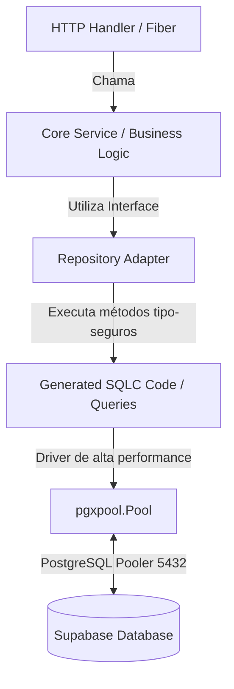

# 📐 Plano de Arquitetura e Migração de Banco de Dados: GORM ➔ SQLC + pgx/v5

**Documento:** Plano de Migração Técnica e Arquitetura de Banco de Dados  
**Projeto:** Dental Clinic CRM (`backend-go`)  
**Autor:** Go Architect Agent  
**Versão:** 1.0  
**Status:** Planejamento & Arquitetura  

---

## 1. Objetivo da Migração

Substituir o ORM GORM (`gorm.io/gorm`) pelo compilador de SQL fortemente tipado **SQLC** em conjunto com o driver PostgreSQL de alta performance **`pgx/v5`** (`github.com/jackc/pgx/v5/pgxpool`).

### 🎯 Benefícios Esperados
1. **Performance Máxima (Zero Reflection):** Elimina o overhead de reflexão do GORM, reduzindo o tempo de execução de queries em até 3x a 5x.
2. **Type-Safety em Tempo de Compilação:** Consultas SQL erradas ou com incompatibilidade de colunas são detectadas durante a compilação do Go (`sqlc generate`), impedindo bugs em produção.
3. **Controle Total de SQL:** Fim das queries "mágicas" do GORM. 100% das consultas serão escritas em arquivos SQL explícitos.

---

## 2. Visão Geral da Arquitetura Alvo (Clean Architecture com SQLC)



---

## 3. Estrutura de Arquivos Proposta (`backend-go`)

```
backend-go/
├── sqlc.yaml                        # Configuração principal do SQLC
├── db/
│   ├── schema/                      # DDL do banco de dados (espelho do /supabase/migrations)
│   │   └── schema.sql
│   ├── queries/                     # Consultas SQL por domínio
│   │   ├── clinics.sql
│   │   ├── users.sql
│   │   ├── patients.sql
│   │   ├── appointments.sql
│   │   ├── financial.sql
│   │   └── inventory.sql
│   └── sqlc/                        # Código Go GERADO AUTOMATICAMENTE pelo SQLC
│       ├── db.go
│       ├── models.go
│       ├── clinics.sql.go
│       ├── users.sql.go
│       └── patients.sql.go
├── internal/
│   ├── database/
│   │   └── database.go              # Conexão com pgxpool.Pool
│   └── adapters/
│       └── repositories/            # Repositórios usando as queries do SQLC
```

---

## 4. Fases de Execução do Plano de Migração

### 📌 Fase 1: Setup e Configuração da Ferramenta (`sqlc.yaml`)
Criar o arquivo de configuração `backend-go/sqlc.yaml`:

```yaml
version: "2"
sql:
  - schema: "db/schema/schema.sql"
    queries: "db/queries"
    gen:
      go:
        package: "sqlc"
        out: "db/sqlc"
        sql_package: "pgx/v5"
        emit_json_tags: true
        emit_prepared_queries: false
        emit_exact_table_names: false
```

### 📌 Fase 2: Escrita das Queries SQL por Domínio

#### Exemplo 1: `db/queries/users.sql`
```sql
-- name: GetUserByID :one
SELECT id, clinic_id, role_id, name, email, password, cpf, phone, avatar, created_at, updated_at
FROM users
WHERE id = $1 AND deleted_at IS NULL;

-- name: GetUserByEmail :one
SELECT id, clinic_id, role_id, name, email, password, cpf, phone, avatar, created_at, updated_at
FROM users
WHERE email = $1 AND deleted_at IS NULL;

-- name: CreateUser :one
INSERT INTO users (clinic_id, role_id, name, email, password, cpf, phone)
VALUES ($1, $2, $3, $4, $5, $6, $7)
RETURNING id, clinic_id, role_id, name, email, password, cpf, phone, created_at, updated_at;
```

#### Exemplo 2: `db/queries/patients.sql`
```sql
-- name: ListPatientsByClinic :many
SELECT id, clinic_id, full_name, cpf_encrypted, email, phone_encrypted, birth_date, health_insurance, created_at
FROM patients
WHERE clinic_id = $1 AND deleted_at IS NULL
ORDER BY full_name ASC
LIMIT $2 OFFSET $3;

-- name: CreatePatient :one
INSERT INTO patients (clinic_id, full_name, cpf_encrypted, email, phone_encrypted, cep, street, neighborhood, number, health_insurance, birth_date, medical_history, notes_encrypted)
VALUES ($1, $2, $3, $4, $5, $6, $7, $8, $9, $10, $11, $12, $13)
RETURNING id, clinic_id, full_name, cpf_encrypted, email, phone_encrypted, created_at;
```

### 📌 Fase 3: Conexão com `pgx/v5` (`internal/database/database.go`)

Substituição do driver GORM por `pgxpool`:

```go
package database

import (
	"context"
	"log"
	"os"

	"dental-crm-api/db/sqlc"

	"github.com/jackc/pgx/v5/pgxpool"
)

var (
	Pool    *pgxpool.Pool
	Queries *sqlc.Queries
)

func Connect() {
	dsn := os.Getenv("DATABASE_URL")
	if dsn == "" {
		log.Fatal("❌ DATABASE_URL não configurada.")
	}

	config, err := pgxpool.ParseConfig(dsn)
	if err != nil {
		log.Fatalf("❌ Erro ao parsear DSN do pgxpool: %v", err)
	}

	pool, err := pgxpool.NewWithConfig(context.Background(), config)
	if err != nil {
		log.Fatalf("❌ Falha ao conectar via pgxpool: %v", err)
	}

	if err := pool.Ping(context.Background()); err != nil {
		log.Fatalf("❌ Ping no banco falhou: %v", err)
	}

	Pool = pool
	Queries = sqlc.New(pool)
	log.Println("✅ Conectado com sucesso via pgx/v5 Pool e SQLC!")
}
```

### 📌 Fase 4: Refatoração da Camada de Repositórios

Adaptação do `UserRepository` para utilizar as queries compiladas pelo SQLC sem alterar as assinaturas de serviço do Core (`internal/core/services`).

---

## 5. Checklist de Validação da Migração

- [ ] Instalação do CLI `sqlc` (`go install github.com/sqlc-dev/sqlc/cmd/sqlc@latest`).
- [ ] Geração do código compilado via `sqlc generate`.
- [ ] Remoção das dependências do GORM (`go mod tidy`).
- [ ] Execução dos testes unitários da aplicação (`go test ./...`).
- [ ] Validação da esteira de CI/CD no GitHub Actions.
