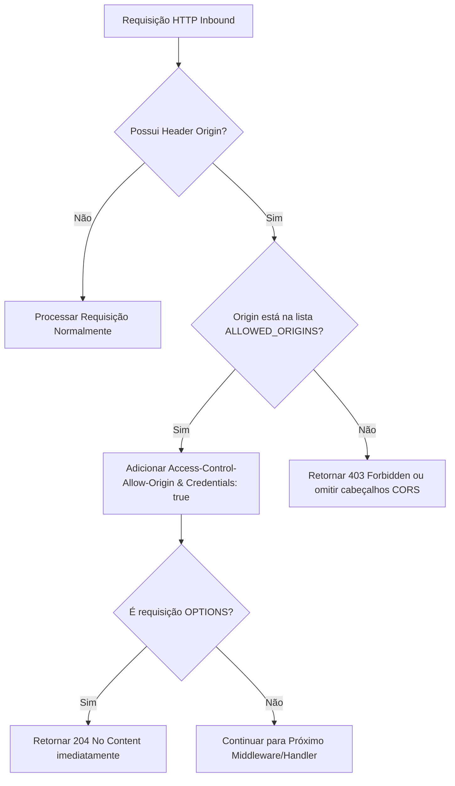

# Technical Specification (Spec): F01 - CORS & Health Check Backend

**Feature:** `F01-cors-and-health-backend`  
**Derivação:** Extensão do PRD [tasks/prd-deploy-render-vercel.md](file:///C:/Users/progc/Daniel/dental-clinic-crm/tasks/prd-deploy-render-vercel.md) e Spec Geral [tasks/spec-deploy-render-vercel.md](file:///C:/Users/progc/Daniel/dental-clinic-crm/tasks/spec-deploy-render-vercel.md)  
**Status:** Aprovado  
**Data:** 2026-07-24  
**Localização:** `features/F01-cors-and-health-backend/spec.md`  

---

### 1. Technical Overview

- **Feature**: Reestruturação do Middleware de CORS e Implementação do Endpoint de Saúde (`/healthz`).
- **Tech Stack Used**: Go 1.26, Fiber v2 (`github.com/gofiber/fiber/v2`), GORM, Supabase Connection Pooler (`aws-0-[regiao].pooler.supabase.com:5432`).
- **Architecture Approach**: Middleware Global HTTP para liberação seletiva de origens CORS e Handler isolado em `internal/adapters/handlers/health_handler.go` exposto via `internal/adapters/routes/routes.go`.

---

### 2. Data Models & Schema

#### 2.1 Estrutura de Resposta do Health Check (`HealthResponse`)

Não há tabelas novas no banco de dados. O endpoint consulta o estado operacional do Pooler existente.

```go
package handlers

import "time"

type HealthResponse struct {
    Status    string    `json:"status"`               // "ok" ou "error"
    Database  string    `json:"database"`             // "connected" ou "disconnected"
    Timestamp time.Time `json:"timestamp"`            // Data/Hora UTC atual
    Message   string    `json:"message,omitempty"`    // Detalhe de erro se houver
}
```

#### 2.2 Schema da Variável de Ambiente (`ALLOWED_ORIGINS`)

- **Nome:** `ALLOWED_ORIGINS`
- **Tipo:** `string` (Separada por vírgulas ou curingas suportados pelo Fiber CORS)
- **Valor Padrão (Fallback em Código):**
  `"https://crm-clinica-ten.vercel.app,http://localhost:3000,http://localhost:8080,http://localhost:5000"`

---

### 3. Component Architecture (Handlers & Middlewares)

#### 3.1 Custom CORS Middleware (`backend-go/cmd/server/main.go`)
- **Responsabilidade**: Interceptar requisições HTTP e validar se o cabeçalho `Origin` está autorizado.
- **Configuração do Fiber CORS:**
  - `AllowOrigins`: Conteúdo lido de `os.Getenv("ALLOWED_ORIGINS")` (com fallback).
  - `AllowCredentials`: `true` (Permite envio de cabeçalhos de autenticação JWT/Cookies).
  - `AllowHeaders`: `"Origin, Content-Type, Accept, Authorization, X-Requested-With"`.
  - `AllowMethods`: `"GET, POST, PUT, DELETE, OPTIONS, PATCH"`.
  - `MaxAge`: `86400` (Cache da requisição Preflight `OPTIONS` por 24 horas).

#### 3.2 `HealthHandler` (`backend-go/internal/adapters/handlers/health_handler.go`)
- **Métodos:**
  - `Check(c *fiber.Ctx) error`: Processa a checagem de saúde da API e ping do banco de dados PostgreSQL via GORM/Supabase Pooler.
- **Rotas Mapeadas:**
  - `GET /healthz` (Endpoint padrão Kubernetes/Cloud Probe)
  - `GET /health` (Manutenção da rota legada)

---

### 4. Core Logic & Algorithms

#### 4.1 Algoritmo de Validação do Health Check (`GET /healthz`)

1. **Passo 1:** Instanciar contexto com timeout curto de 3 segundos (`context.WithTimeout(context.Background(), 3*time.Second)`).
2. **Passo 2:** Obter o objeto `*sql.DB` a partir da instância global `database.DB` (GORM).
3. **Passo 3:** Invocar `sqlDB.PingContext(ctx)`.
4. **Passo 4:**
   - **Caso `err == nil`:**
     Montar `HealthResponse{Status: "ok", Database: "connected", Timestamp: time.Now().UTC()}`.  
     Retornar com status `HTTP 200 OK`.
   - **Caso `err != nil`:**
     Montar `HealthResponse{Status: "error", Database: "disconnected", Timestamp: time.Now().UTC(), Message: err.Error()}`.  
     Retornar com status `HTTP 503 Service Unavailable`.

#### 4.2 Algoritmo de CORS Preflight



---

### 5. Error Handling & Edge Cases

- **Cenário 1: Queda/Instabilidade na Conexão com o Supabase Pooler**
  - **Comportamento Esperado:** O `PingContext` atinge o timeout de 3s e o `/healthz` responde `503 Service Unavailable` sem travar a thread do Fiber.
- **Cenário 2: `ALLOWED_ORIGINS` não declarada no ambiente do Render**
  - **Comportamento Esperado:** O sistema utiliza o fallback seguro contendo `https://crm-clinica-ten.vercel.app` e `http://localhost:*`.
- **Cenário 3: Subdomínio de Preview da Vercel (`https://*-tenant.vercel.app`)**
  - **Comportamento Esperado:** O middleware permite a origem informada se corresponder aos padrões permitidos no Fiber CORS.

---

### 6. Security & Performance

- **Segurança:** 
  - Restrição do `Access-Control-Allow-Origin` aos domínios estritamente conhecidos.
  - Sanitização do cabeçalho `Authorization` nos logs de acesso.
- **Performance:**
  - O endpoint `/healthz` executa uma query de ping ultra-leve no banco de dados sem alocação pesada de memória.
  - O cache de Preflight (`MaxAge: 86400`) evita requisições `OPTIONS` repetitivas a cada chamada de API no frontend.
