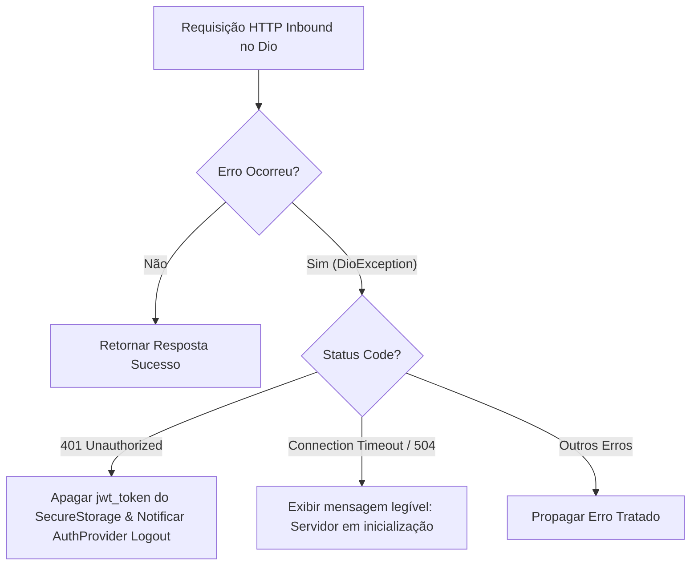

# Technical Specification (Spec): F02 - Flutter Web & Vercel Build Optimization

**Feature:** `F02-flutter-web-vercel-build`  
**Derivação:** Extensão do PRD [tasks/prd-deploy-render-vercel.md](file:///C:/Users/progc/Daniel/dental-clinic-crm/tasks/prd-deploy-render-vercel.md) e Spec Geral [tasks/spec-deploy-render-vercel.md](file:///C:/Users/progc/Daniel/dental-clinic-crm/tasks/spec-deploy-render-vercel.md)  
**Status:** Aprovado  
**Data:** 2026-07-24  
**Localização:** `features/F02-flutter-web-vercel-build/spec.md`  

---

### 1. Technical Overview

- **Feature**: Otimização do Build de Produção do Flutter Web na Vercel e Resiliência no Cliente HTTP.
- **Tech Stack Used**: Dart 3.12.2, Flutter Web, Dio HTTP Client (`package:dio`), Riverpod, `go_router`, `flutter_secure_storage`, Shell Script (`build.sh`), Vercel Build Pipeline.
- **Architecture Approach**: Compilação estática do Flutter Web via script automatizado com injeção de constantes de compilação (`--dart-define`) e reescrita de rotas SPA no `vercel.json`.

---

### 2. Data Models & Configuration Schema

#### 2.1 Schema da Injeção de Variáveis em Tempo de Compilação (`--dart-define`)

| Nome da Constante | Fonte / Origem | Valor Padrão (Fallback) | Finalidade |
| :--- | :--- | :--- | :--- |
| `API_BASE_URL` | `build.sh` / Vercel Environment | `https://crm-clinica-gjss.onrender.com` | Endereço base da API backend no Render |

#### 2.2 Schema da Configuração do Dio (`api_client.dart`)

```dart
BaseOptions(
  baseUrl: apiBaseUrl, // Concatenado com /api/v1
  connectTimeout: const Duration(seconds: 30), // Aumentado para 30s (Cold Start)
  receiveTimeout: const Duration(seconds: 30),
  headers: {
    'Content-Type': 'application/json',
    'Accept': 'application/json',
  },
)
```

#### 2.3 Schema de Roteamento Vercel (`vercel.json`)

```json
{
  "version": 2,
  "rewrites": [
    {
      "source": "/(.*)",
      "destination": "/index.html"
    }
  ]
}
```

---

### 3. Component Architecture

#### 3.1 `build.sh` (Script de Automação Vercel)
- **Responsabilidade**: Baixar/atualizar o Flutter SDK (branch `stable`, `--depth 1`), restaurar pacotes pub (`flutter pub get`) e compilar para web release.
- **Comando de Compilação:**
  ```bash
  flutter build web --release --dart-define=API_BASE_URL=https://crm-clinica-gjss.onrender.com
  ```

#### 3.2 `ApiClient` (`frontend_flutter/lib/core/network/api_client.dart`)
- **Responsabilidade**: Resolver a URL base limpa sem duplicar `/api/v1`, anexar o cabeçalho `Authorization: Bearer <jwt_token>` e capturar erros de autenticação (401) e timeout.

---

### 4. Core Logic & Algorithms

#### 4.1 Algoritmo de Resolução da Base URL

1. Ler a constante `_rawBaseUrl` via `String.fromEnvironment('API_BASE_URL', defaultValue: 'https://crm-clinica-gjss.onrender.com')`.
2. Se `_rawBaseUrl` contiver o sufixo `/api/v1`, remover o sufixo para normalização.
3. Remover barras finais extras (`/`).
4. Retornar `apiBaseUrl` no formato `$backendBaseUrl/api/v1`.

#### 4.2 Algoritmo de Tratamento de Erros no Dio Interceptor



---

### 5. Error Handling & Edge Cases

- **Cenário 1: Cold Start do Render (Timeout de Conexão)**
  - **Tratamento:** O `connectTimeout` de 30 segundos impede que a requisição seja cancelada prematuramente enquanto o container do Render desperta.
- **Cenário 2: Atualização de Página em Sub-rotas (`F5` em `/patients/45`)**
  - **Tratamento:** O `vercel.json` intercepta a requisição e serve o `index.html`, permitindo que o `go_router` restaure a rota no lado do cliente.

---

### 6. Security & Performance

- **Segurança:** Armazenamento seguro de tokens JWT no `flutter_secure_storage`.
- **Performance:** Compilação do Flutter em modo `--release` otimizando tamanho dos bundles JS/Wasm.
