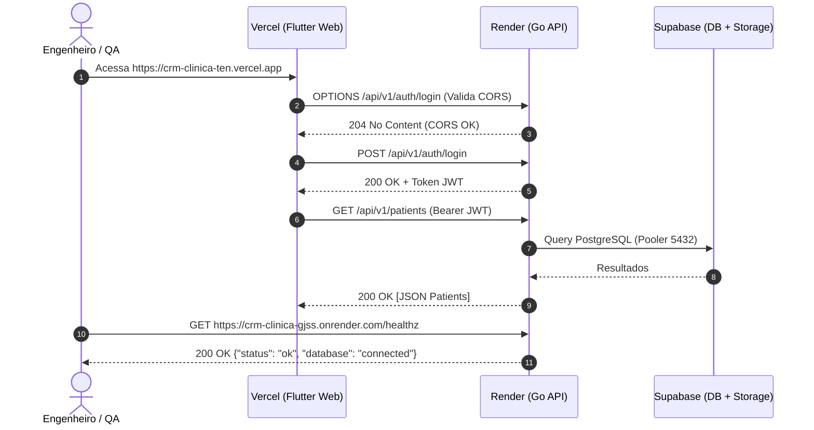

# Technical Specification (Spec): F04 - End-to-End Verification & Keep-Alive Strategy

**Feature:** `F04-e2e-verification-and-keepalive`  
**Derivação:** Extensão do PRD [tasks/prd-deploy-render-vercel.md](file:///C:/Users/progc/Daniel/dental-clinic-crm/tasks/prd-deploy-render-vercel.md) e Spec Geral [tasks/spec-deploy-render-vercel.md](file:///C:/Users/progc/Daniel/dental-clinic-crm/tasks/spec-deploy-render-vercel.md)  
**Status:** Aprovado  
**Data:** 2026-07-24  
**Localização:** `features/F04-e2e-verification-and-keepalive/spec.md`  

---

### 1. Technical Overview

- **Feature**: Homologação E2E (Ponta a Ponta) da Unificação Vercel-Render e Estratégia de Keep-Alive para Render Free Tier.
- **Tech Stack Used**: Uptime Monitoring Probes (ex: UptimeRobot, Cron HTTP Client), Browser DevTools (Network / Security Audit), Dio Interceptors.
- **Architecture Approach**: Protocolo de testes de integração síncronos e configuração de agendador HTTP remoto para prevenção do modo repouso (*sleep*) do container no Render.

---

### 2. Data Models & Configuration Schema

#### 2.1 Schema do Agendador de Keep-Alive

| Parâmetro | Valor Configurado | Justificativa |
| :--- | :--- | :--- |
| **Target URL** | `https://crm-clinica-gjss.onrender.com/healthz` | Endpoint público leve sem efeito colateral no banco |
| **Intervalo** | A cada 12 minutos (`*/12 * * * *`) | O Render entra em *sleep* após 15 minutos sem tráfego |
| **Método HTTP** | `GET` | Causa impacto mínimo de processamento |
| **Status Esperado** | `200 OK` | Valida API + Supabase Pooler |

---

### 3. Component Architecture & Flow

#### 3.1 Suite de Verificação E2E
1. **Verificação 1 (CORS & Security):** Requisição Preflight `OPTIONS` da origem `https://crm-clinica-ten.vercel.app` para a API do Render.
2. **Verificação 2 (Autenticação JWT):** Submissão de credenciais no formulário do Flutter Web e recebimento de JWT válido.
3. **Verificação 3 (Leitura/Escrita no Supabase):** Listagem de pacientes e criação de novo registro.
4. **Verificação 4 (Storage Cloud):** Upload de anexo e validação da abertura da URL do Supabase Storage.
5. **Verificação 5 (Health check):** Acesso a `GET /healthz`.

---

### 4. Core Logic & Algorithms

#### 4.1 Algoritmo de Execução do Teste E2E

---

### 5. Error Handling & Edge Cases

- **Cenário 1: Falha no Ping de Keep-Alive**
  - **Tratamento:** Se o serviço de monitoramento receber 503 ou timeout do Render, um alerta deve ser emitido no dashboard de monitoramento para inspeção dos logs do Render.

---

### 6. Security & Performance

- **Segurança:** O endpoint de keep-alive não expõe chaves nem dados sensíveis.
- **Performance:** Manter a instância ativa reduz a latência da primeira requisição do usuário de ~50s (cold start) para < 300ms.
