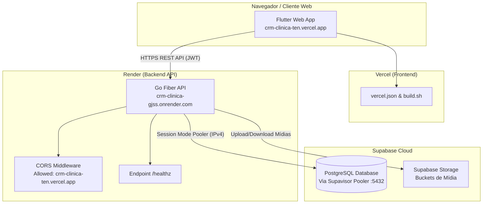

# Product Requirements Document (PRD)

## PRD: Deploy, Ajustes de Infraestrutura e Unificação Frontend (Vercel) + Backend (Render)

**ID:** `PRD-DEPLOY-UNIFICACAO-001`  
**Status:** Aprovado  
**Data:** 2026-07-24  
**Autor:** Antigravity AI & Equipe de Engenharia Dental Clinic CRM  
**Repositórios / Projetos:** `backend-go` e `frontend_flutter`  

---

### 1. Executive Summary / Introduction

#### Problem Statement
Atualmente, o sistema **Dental Clinic CRM** possui a API backend em Go publicada no Render (`https://crm-clinica-gjss.onrender.com`) e o aplicativo web em Flutter publicado na Vercel (`https://crm-clinica-ten.vercel.app`). No entanto, ocorrem divergências na integração entre as duas partes:
1. Problemas de CORS e configurações de Origem permitida no Fiber.
2. Armazenamento de arquivos tentando utilizar o disco local efêmero do Render em vez de Supabase Storage.
3. Ausência de validação padronizada da injeção de `API_BASE_URL` no build do Flutter Web.
4. Ausência de endpoint de health check dedicado para manter o container do Render ativo (keep-alive) e monitorar a conexão com a base PostgreSQL via Supabase Pooler.

#### Proposed Solution
Unificar e alinhar totalmente as configurações de ambiente, CORS, injeção de dependências e storage entre Vercel e Render:
1. Configurar o CORS no Fiber (`backend-go`) para aceitar requisições de `https://crm-clinica-ten.vercel.app`, origens `*.vercel.app` e `localhost`.
2. Assegurar a injeção da flag `--dart-define=API_BASE_URL=https://crm-clinica-gjss.onrender.com` no script de build `build.sh` / `vercel.json`.
3. Garantir o uso estrito do **Supabase Storage** no backend Go para manipulação de mídias e documentos dos pacientes.
4. Implementar o endpoint `/healthz` no Go para monitorar banco de dados e prover mecanismo de keep-alive no Render.

#### Goals & Success Metrics
- **Conectividade E2E:** 100% de sucesso nas chamadas da API vindas do app publicado na Vercel para a API no Render.
- **Zero Bloqueios de CORS:** 0 erros de política `Cross-Origin Resource Sharing` no console do navegador ao acessar `crm-clinica-ten.vercel.app`.
- **Persistência de Dados & Arquivos:** 100% dos uploads de arquivos redirecionados e gravados com sucesso no Supabase Storage (sem dependência do disco efêmero do Render).
- **Disponibilidade (Uptime):** Resposta em menos de 300ms para o endpoint `/healthz` validando status da API e DB Supabase.

---

### 2. User Stories

#### US-001: Comunicação Transparente Frontend-Backend sem Bloqueios de CORS
**Descrição:** Como usuário da clínica odontológica acessando `https://crm-clinica-ten.vercel.app`, quero fazer login e navegar pelo sistema sem falhas de rede ou bloqueio de CORS.

**Acceptance Criteria:**
- [ ] O middleware de CORS em `backend-go/internal/middleware/cors.go` (ou equivalente) permite origens `https://crm-clinica-ten.vercel.app`, `https://*.vercel.app` e `http://localhost:*`.
- [ ] O header `Access-Control-Allow-Credentials: true` e os métodos HTTP exigidos (GET, POST, PUT, DELETE, OPTIONS, PATCH) estão configurados adequadamente.
- [ ] Typecheck/lint do Go passa sem erros (`go vet ./...` / `go mod tidy`).
- [ ] **[UI]** Validação no navegador confirmando resposta HTTP 200 nas chamadas `/api/auth/login` e rotas autenticadas enviando JWT.

#### US-002: Injeção Dinâmica da URL da API no Build do Flutter Web na Vercel
**Descrição:** Como desenvolvedor/DevOps, quero garantir que a compilação do Flutter Web na Vercel receba o endereço oficial da API em tempo de build (`API_BASE_URL`), evitando hardcoding de endereços no código-fonte.

**Acceptance Criteria:**
- [ ] O arquivo `frontend_flutter/build.sh` compila a aplicação com `--dart-define=API_BASE_URL=https://crm-clinica-gjss.onrender.com`.
- [ ] O arquivo `frontend_flutter/vercel.json` está ajustado para executar o build correto e direcionar rotas para `index.html` (SPA routing com `go_router`).
- [ ] A classe de configuração `ApiConfig` ou repositório HTTP Dio no Flutter lê `String.fromEnvironment('API_BASE_URL')` com fallback seguro.
- [ ] Lint do Flutter passa sem avisos impeditivos (`flutter analyze`).

#### US-003: Armazenamento em Nuvem no Supabase Storage
**Descrição:** Como dentista/administrador, quero enviar anexos de exames e fotos de pacientes e saber que esses arquivos estarão salvos de forma permanente na nuvem.

**Acceptance Criteria:**
- [ ] Nenhum arquivo de upload é salvo no disco efêmero `/uploads/` do Render em ambiente de produção.
- [ ] Os módulos de upload no backend utilizam a API do Supabase Storage com o bucket configurado via `.env` (`SUPABASE_URL`, `SUPABASE_KEY`).
- [ ] URLs públicas ou assinadas geradas pelo Supabase Storage são retornadas corretamente para o aplicativo Flutter.

#### US-004: Endpoint de Monitoramento de Saúde (`/healthz`) e Keep-Alive
**Descrição:** Como administrador do sistema, quero ter um endpoint leve de verificação de saúde para monitorar se a API Go e o banco Supabase estão operacionais e manter o container no Render ativo.

**Acceptance Criteria:**
- [ ] O backend Go expõe a rota pública `GET /healthz`.
- [ ] O endpoint executa um `PING` no banco de dados via GORM/Supabase Pooler e retorna JSON com status `{"status": "ok", "db": "connected", "timestamp": "..."}` com status HTTP 200 (ou 503 se o DB estiver fora).
- [ ] Documentação de instrução sobre como configurar ping periódico (ex: UptimeRobot ou Cron) apontando para `https://crm-clinica-gjss.onrender.com/healthz`.

---

### 3. Functional Requirements

1. **FR-1:** O servidor Go (Fiber) deve carregar as variáveis de ambiente necessárias (`PORT`, `DATABASE_URL`, `JWT_SECRET`, `SUPABASE_URL`, `SUPABASE_KEY`, `ALLOWED_ORIGINS`).
2. **FR-2:** O repositório de conexão com o banco de dados deve utilizar obrigatoriamente a URL do **Connection Pooler do Supabase** (`aws-0-[regiao].pooler.supabase.com:5432`) com o sufixo de usuário `postgres.[PROJECT_REF]` e aplicar a sanitização `cleanDSN` contra quebras de linha e aspas.
3. **FR-3:** O frontend Flutter deve configurar os interceptores do `Dio` para anexar o token JWT no cabeçalho `Authorization: Bearer <token>` em todas as requisições autenticadas.
4. **FR-4:** O arquivo `vercel.json` deve incluir reescritas para SPA (`/.*` -> `/index.html`) evitando erro 404 ao atualizar a página navegando em sub-rotas do `go_router`.
5. **FR-5:** Em caso de falha de conexão com a API no Render, o aplicativo Flutter deve apresentar mensagens tratadas com suporte a reconexão em vez de falhas genéricas não tratadas.

---

### 4. Non-Goals (Out of Scope)

- **Não está no escopo:** Migração ou alteração de domínio para URLs personalizadas registradas (serão mantidos os domínios gratuitos `.onrender.com` e `.vercel.app`).
- **Não está no escopo:** Configuração de pipelines automatizadas de CI/CD via GitHub Actions (os deploys serão manuais/sob demanda por meio das integrações nativas Vercel Git & Render Git).
- **Não está no escopo:** Refatoração de regras de negócio internas da clínica ou inclusão de novos módulos funcionais no CRM.

---

### 5. AI System Requirements

*N/A - Este PRD refere-se estritamente à infraestrutura de deploy, integração HTTP/CORS e armazenamento em nuvem.*

---

### 6. Technical Specifications & Design Considerations

#### Architecture Overview & Components
- **Frontend App:** Flutter Web (Dart SDK ^3.12.2), gerenciamento de estado com Riverpod, roteamento via `go_router`, HTTP via Dio.
- **Backend API:** Go 1.26 + Fiber v2. Ponto de entrada em `backend-go/cmd/server/main.go`.
- **Database:** Supabase PostgreSQL conectado obrigatoriamente através do Connection Pooler IPv4 (`aws-0-[regiaoeast].pooler.supabase.com:5432`).
- **Storage:** Supabase Storage para armazenamento permanente de uploads.

#### Security & Privacy
- Uso exclusivo de conexões HTTPS criptografadas.
- Sanitização de variáveis de ambiente no Render.
- Proteção de rotas com JWT (expiração controlada e refresh token se aplicável).

---

### 7. Risks & Open Questions

#### Technical Risks
- **Render Cold Starts (Free Tier):** Instâncias gratuitas do Render entram em modo de repouso após 15 minutos sem tráfego. A primeira requisição após o sleep pode levar até 50 segundos. *Mitigação:* Implementar endpoint `/healthz` e configurar Keep-Alive externo.
- **Render IPv6 Limitations:** O Render não suporta saída direta IPv6. *Mitigação:* Usar rigorosamente o hostname do Pooler do Supabase (`.pooler.supabase.com`) em vez do IP direto do Supabase.

#### Open Questions
- *Nenhuma questão aberta no momento. Todas as definições de domínio, CORS, storage e testes foram pacificadas na fase de Discovery.*

---

### 8. Verification Checklist Before Release

- [ ] `go fmt ./...` e `go test ./...` executados no `backend-go` com 100% de sucesso.
- [ ] `flutter analyze` e `flutter test` executados no `frontend_flutter` com 100% de sucesso.
- [ ] Teste de login e requisições autenticadas efetuado no ambiente de produção (`crm-clinica-ten.vercel.app` -> `crm-clinica-gjss.onrender.com`).
- [ ] Validação do endpoint `/healthz` retornando status 200 OK.
